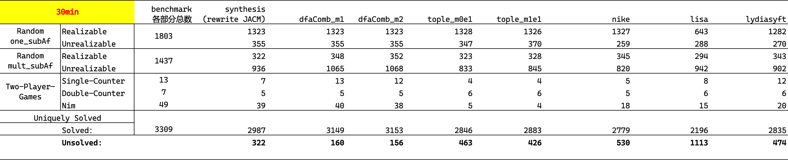
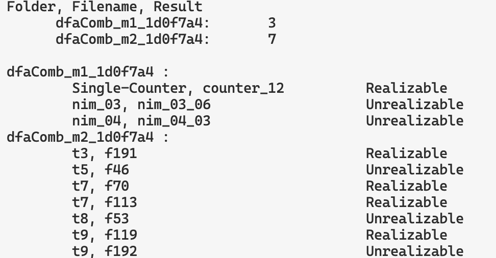
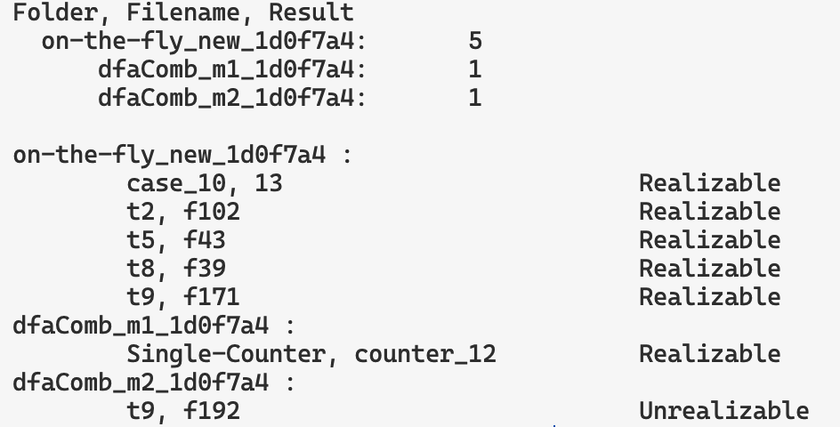

## 实验效果提升

提升来源应该是优化了selfLoop的处理:

- 会优先搜索非selfLoop的边
- 之前代码可能有一些细节上的缺陷

相比之前，主要变化在Ascending数据集上, dfaComb_m1和m2同步提升60个左右,
on-the-fly版本有更大提升(比上个版本多解出80个), 这应该是因为它可以把selfLoop边全部视作failed边, 即非策略

> 另外, dfaComb_m1和m2上次能解出来的, 这次依旧能解出来;    
> on-the-fly版本, 也只在Lydia数据集上有5个上次能解出, 而这次没解出来

## 另外, 调整了cudd的配置

使用 `Cudd_SetMaxCacheHard` API提升缓存上限到 2GB, 这也可能是导致本次实验提升的原因   

## 方法间的对比

### 所有方法

### dfaComb_m1 VS m2

### 我们的三种方法对比

